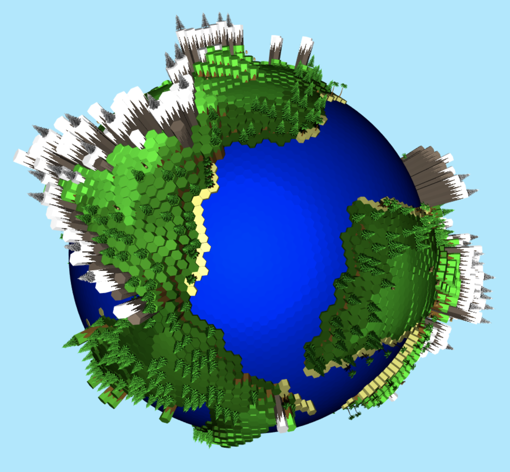
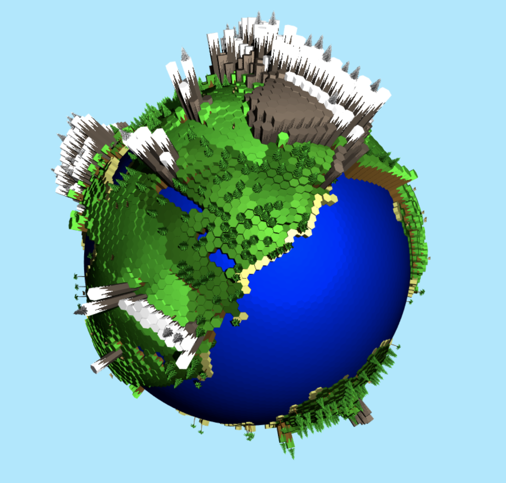
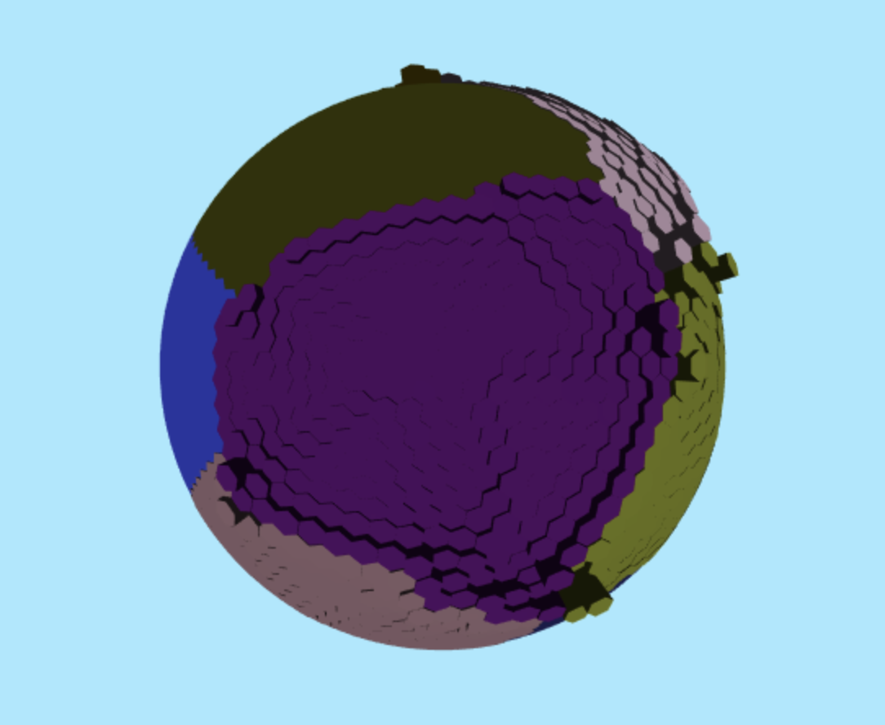
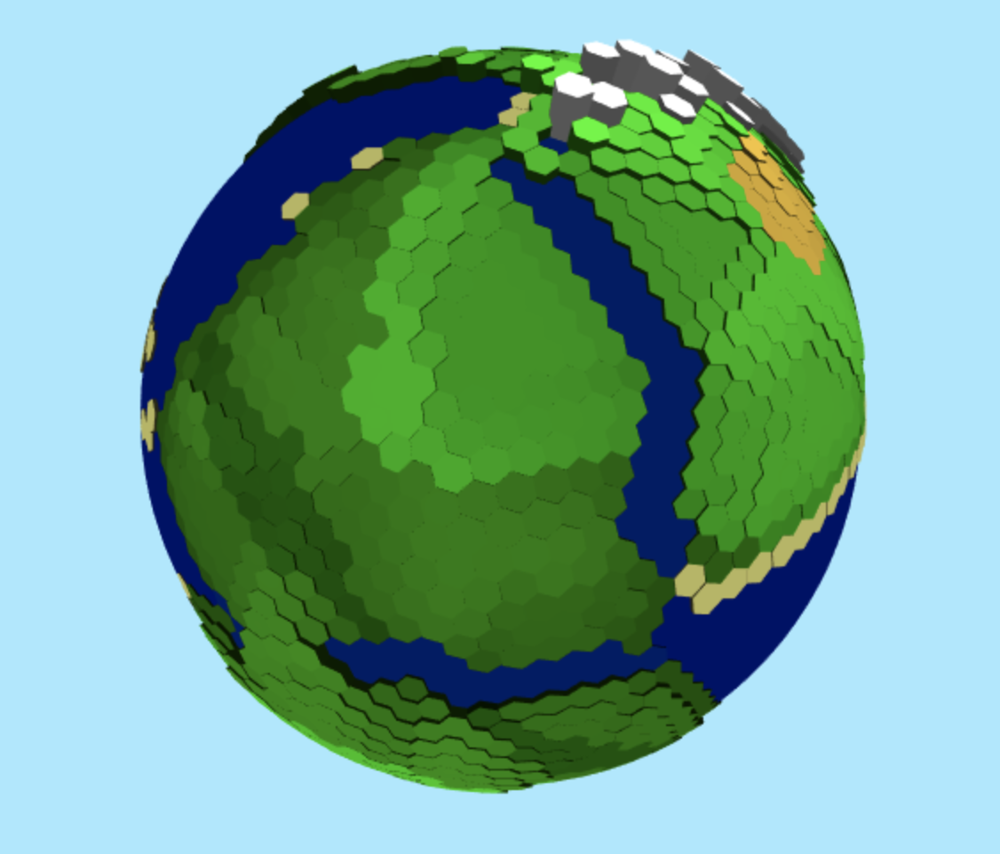
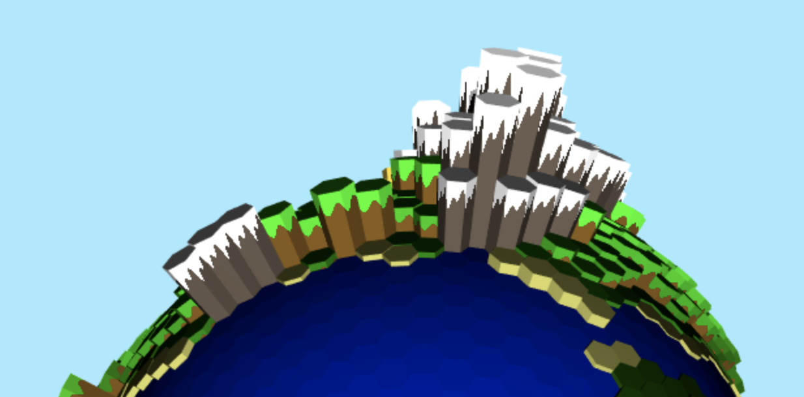
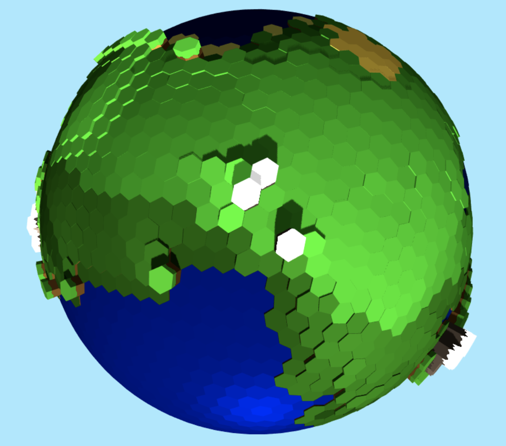
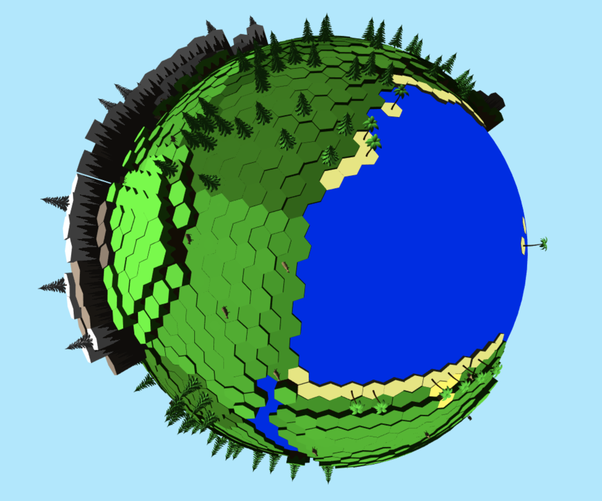

# Procedural Planet Generator #
Demo Link: https://nkeenan38.github.io/Procedural-Planet-Generator/

### Planet Geometry ###
To create the tiled sphere, I started with an icosahedron. The plan was to subdivide this icosahedron and get the dual polyhedron from that. A dual of a polyhedron is one where the vertices of one correspond to the faces of the other and the edges between pairs of vertices of one correspond to the edges between pairs of faces of the other. The dual of an icosahedron is a dodecahedron, but the dual of higher subdivisions create tiled spheres that consist mostly of hexagons.

The number of tiles on the planet increases with each subdivsion. This is the result of subdividing four times and getting the dual polyhedron.

### Elevation ####
#### Tectonic Plates ####
To decide the height of each tile, I took an approach involving tectonic plates. I chose several random starting tiles for each plate and did a flood fill from each tile to its neighbors until another plate was reached. This did a pretty good job at creating the plates. I also did some extra cleaning to prevent jagged plate edges. Each plate is assigned a random elevation, which is also used to determine if the plate is oceanic or continental. Each plate is also assigned a random velocity.
#### Collisions ####
Interplate elevation is determined by how the plates interact with each other. Here is where the plate's velocity is used. There are three possibilities for how plates interact at their boundaries: converge, diverge, or slide. The effects of these interactions depends on the type of plate (oceanic or continental). Here is how these scenarios affect the terrain.

| Collision Types          | Diverge                  | Converge              | 
| -------------            | ---------------          | ---------------       |
| Oceanic, Oceanic         | Oceanic Rift             | Volcanic Islands      | 
| Continental, Oceanic     | Coastline                | Coastal Mountain      |
| Continental, Continental | Continental Rift/Valley  | Continental Mountain  |

Sliding mostly just causes earthquakes and no huge geological formations, so I largely ignore those. Coastal mountains are shorter than continental mountains. In the former, the oceanic crust is subducted under the continental and just pushes it up. In the former, both continental crusts push against each other and rise up in the process. Once the elevation of each tile is determined, I extrude that tile out of the sphere by an amount proportional to its elevation.

### Temperature ###
Getting the initial temperature was relatively straightforward. This planet doesn't have any seasons, so I assumed the equator is closest to the sun and the northern and southern hemispheres are the same distance from the sun. Using these assumptions, the temperature is hottest at the equator and decreases as we approach the poles, as is expected. I then used the terrain height to add some more variability to temperature (high elevations have lower temperature). Temperature and precipitation, which I'll talk about next, both influence the other. Higher precipitation tends to make temperatures less extreme due to the higher heat capacity of water. This is why deserts can get so hot during the day and cold at night. So higher precipitation drove the temperature closer to the middle.

In the temeperature map below, higher temperatures are colored in red and cooler temperatures are blue.

### Precipitation ###
For precipation, I used the assumption that areas closer to water would get more precipitation than further ones. So that's exactly what I did, the closer to an ocean or lake, the higher the precipitation. I also didn't allow precipation to move across mountains, creating the rain shadows that we see in reality. The last thing to do was calculate the temperature's effect on precipitation. Higher temperatures lead to more evaporation which leads to more precipitation. 

In the precipiation map below, blue corresponds to higher precipitation and red corresponds to less.

### Biomes ###
The biomes are determined by using tectonic plate type, boundary event, elevation, temperature, and precipitation of each tile. The different biomes are:
* **Snowy Mountain:** High Elevetion, Low Temperature
* **Rocky Mountain:** High Elevation, Mid to High Temperature
* **Desert:** Low Precipitation, Mid to High Temperature
* **Tundra:** Low Precipitation, Low Temperature
* **Grassland:** Mid Precipitation, Mid Temperature
* **Jungle:** High Precipitation, High Temperature
* **Forest:** High Precipation, Low to Mid Temperature
* **Lake:** Fills continental rifts
* **Ocean:** Covers oceanic tectonic plates
* **Island:** Occurs at convergent oceanic plates
* **Coast:** Occurs at the divergent and sliding boundaries between continental and oceanic plates

I then added some more details and colors to the sides of the tiles to enhance the landscape.

### Shadows ###
To add the shadows, I add a virtual sun as the light source. I first do an inital render of my scene from the sun's perspective instead of the camera. I only use this render to create a depth map (nothing is drawn to the screen at this point). During the second render from the camera's point of view, I use this depth map to determine if a point lies in a shadow or not. I do this by calculating the distance from that point to the sun. If the distance is larger than what is found in the depth map, then there is an object between that point and the sun, so it must be in a shadow. 

### Assets ###
I've added some procedurally placed assets in the form of trees and cows. You'll find palm trees in tropical biomes (on beachy coasts or islands). Fir trees populate the forest biomes. Snowy fir trees are found on snowy mountain peaks. And finally, cows can be found roaming the grasslands. 

