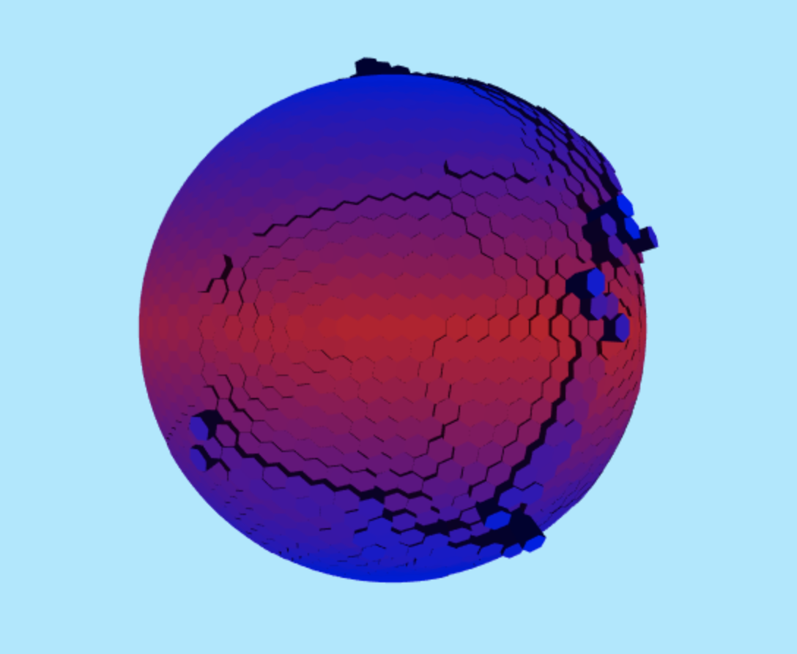

# Procedural Planet Generator #
### Planet Geometry ###
To create the tiled sphere, I started with an icosahedron. The plan was to subdivide this icosahedron and get the dual polyhedron from that. A dual of a polyhedron is one where the vertices of one correspond to the faces of the other and the edges between pairs of vertices of one correspond to the edges between pairs of faces of the other. The dual of an icosahedron is a dodecahedron, but the dual of higher subdivisions create tiled spheres that consist mostly of hexagons.

### Elevation ####
#### Tectonic Plates ####
To decide the height of each tile, I took an approach involving tectonic plates. I chose several random starting tiles for each plate and did a flood fill from each tile to its neighbors until another plate was reached. This did a pretty good job at creating the plates. I also did some extra cleaning to prevent jagged plate edges. Each plate is assigned a random elevation, which is also used to determine if the plate is oceanic or continental. Each plate is also assigned a random velocity.
#### Collisions ####
Interplate elevation is determined by how the plates interact with each other. Here is where the plate's velocity is used. There are three possibilities for how plates interact at their boundaries: converge, diverge, or slide. The effects of these interactions depends on the type of plate (oceanic or continental). Here is how these scenarios affect the terrain.

| Collision Types          | Diverge                  | Converge              | 
| -------------            | ---------------          | ---------------       |
| Oceanic, Oceanic         | Oceanic Rift             | Volcanic Islands      | 
| Continental, Oceanic     | Coastline                | Coastal Mountain      |
| Continental, Continental | Continental Rift/Valley  | Continental Mountain  |

Sliding mostly just causes earthquakes and no huge geological formations, so I largely ignore those. Coastal mountains are shorter than continental mountains. In the former, the oceanic crust is subducted under the continental and just pushes it up. In the former, both continental crusts push against each other and rise up in the process.

### Temperature ###
Getting the temperature was relatively straightforward. This planet doesn't have any seasons, so I assumed the equator is closest to the sun and the northern and southern hemispheres are the same distance from the sun. Using these assumptions, the temperature is hottest at the equator and decreases as we approach the poles, as is expected.

